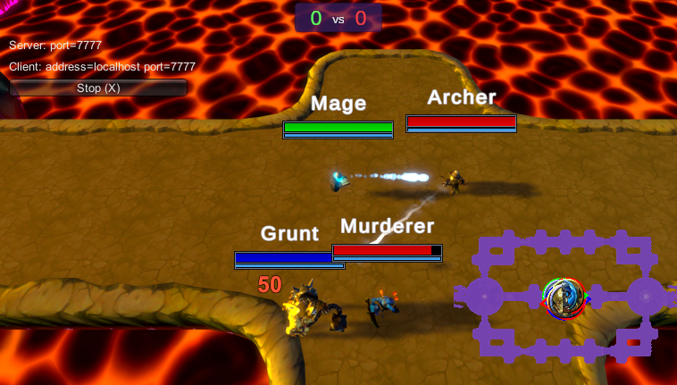
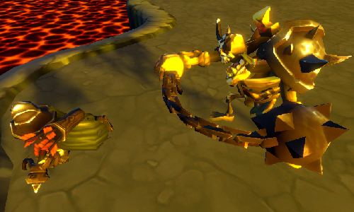
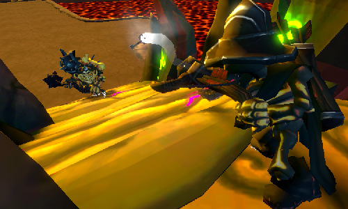
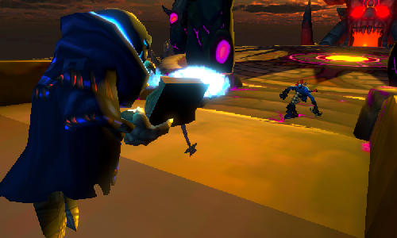
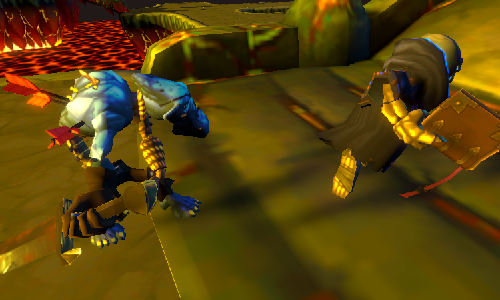
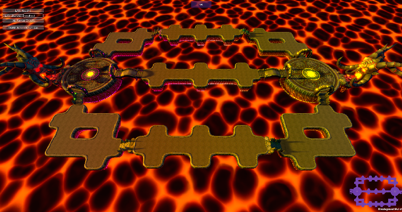

# Mobattack

> Main learning project. Has been started from scratch multiple times.

## How to play

- There is **2 teams**, with a maximum of **3 players** per team.
- You get points for every enemy team member death.
- When one team has **5 points**, the other team's turates _(turret gates)_ fall.
- Then, if a teammate enters the enemy spawn, this is a _win_.

**Controls**

- **Camera Zoom**: Mouse Scrollwheel
- **Move To/Target Character**: Right Mouse

_Only Host_

- **Heal All**: C
- **Damage All**: V

## How to try the game

- Clone or download the project
- Open the Build Folder
- Launch `Mobattack.exe`

### Networking

#### Lan

- Have a player click on _LAN Host_ or press _H_
- Then other players can click on _LAN Client_ or press _C_

#### Online

- Click on _Enable Match Maker_ or press _M_
- Have a player choose a _Room Name_ and then click on _Create Internet Match_
- Then other players can click on _Find Internet Match_
- And finally click on _Join Match:_ followed by the chosen match name

## About the game

This project is my journey from "Yes I think I know what Unity looks like" to "Hey, I have multiplayer across the internet now". It is not the cleanest but I am fairly proud that it exists.
In this state the project is somewhat of a tech demo. This is supposed to be a MOBA, but to turn this into a real game of the genre it would need a lot more work all around.
So now I plan on reusing a lot of it for a real Tower Defense project right around the corner.

This game is made in [Unity](https://unity.com/ "Unity homepage"), with the initial help of the course _[Skeletons vs Zombies MOBA With Multiplayer in Unity](https://www.packtpub.com/application-development/skeletons-vs-zombies-moba-multiplayer-unity-video "Packt store page")_ by [Devslopes](https://devslopes.com/ "Devslopes homepage"). This course really kickstarted the project, since it taught me some basics and had quality models and animations ready to use _(made by [Bitgem](https://shop.bitgem3d.com/collections/bitgem "Bitgem Collection store page"))_.

### Features

- A map to play on, made with multiple levels of **Prefabs** for easy changes if needed.
- A **Character and Team Selection screen**, along with an Input Field for the name.
- Animated Characters, via their **Animator Controller**.
- Use of the **Cinemachine Package** to follow the character and zoom.
- Use of the Unity **Unet** package to make the game multiplayer
  - with a **Network Manager**, and several **Network Identity** and **Network Transform** components.
  - with **NetworkBehaviour** classes and use of the **SyncVar**, **Command** and **ClientRpc** tags.

---

- Characters/_Agents_ moving on a **Navigation Mesh**.
- Tuning the movement speed so that the characters do not appear to slide _too much_ on the ground.
- Relatively complex models simplified on the Navigation Mesh with **Obstacles** or simple **Box Colliders**.

---

- Use of **Canvas** for the UI (the character selection menu, the health bars, the damage/heal numbers, the minimap, the scores, and the win/lose images).
- Use of the **Image Fill** parameter for the health bars.
- Use of randomized **Animations** for the damage/heal numbers.
- Use of overhead **Cameras**, **RenderTextures** and **Masks** for the minimap.
- Use of several **Buttons** and an **Input Field** for the character selection screen.

- **Particle Effects** for projectiles.
- **Trails** for some projectiles and weapon swings.
- **Post Processing** to look better, with **Bloom**, **Ambient Occlusion**, and **Color Grading**.

---

- Characters with a **basic attack loop** all using the same script.
- Basic attack loop can shoot **projectiles**, damage **a target**, or damage a target and **others in range**.
- Use of the **Animation** itself to tell when to damage or launch projectile.

---

- Characters can **die**, triggering a Dead state and spawning an inactive corpse that does the dying animation in their place while they are waiting behind the Spawn to the left of the map. Then, they spawn back after 10 seconds.

---

- Use of the **Universal Render Pipeline** Package to be able to use ShaderGraph.
- Use of **ShaderGraph** to create custom shaders
  - to display a **colored effect** depending on the character's team when the mouse cursor **hovers** on them.
  - to display a **dithered transparent silhouette** of the characters when needed.
  - to progressively **change the color** of the emission texture of the map based on **world position**. It is also lightly applied on the ground texture.
- Customization of the **renderer parameters** to display the character's **silhouette when hidden** by other objects.

