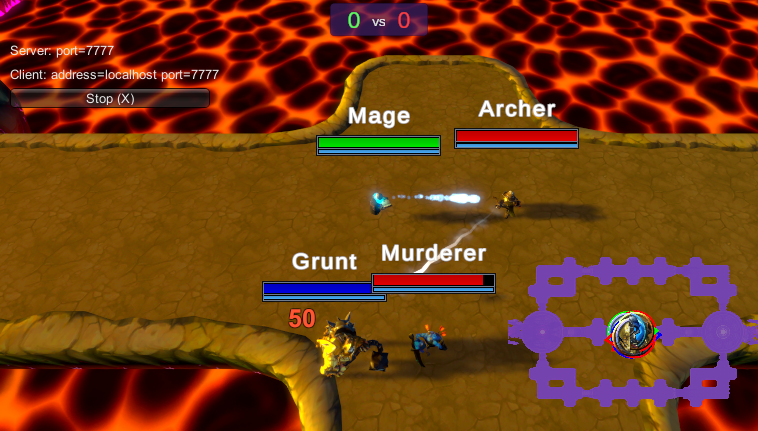
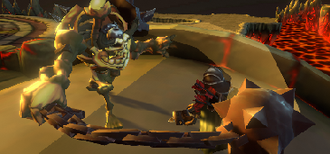
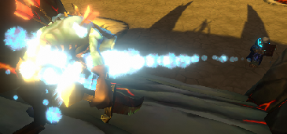
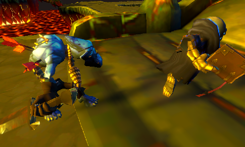

# Mobattack

> Main learning project. Has been started froms scratch multiple times.

**Controls**

- **Camera Movement**: ZQSD or Arrow Keys
- **Camera Zoom**: Mouse Scrollwheel
- **Camera Move To**: Left Mouse _on Minimap_
- **Move To/Target Character**: Right Mouse
- **Spell**: A _(Only on the skeleton mage)_
- **Heal**: C
- **Damage**: X
- **Change Characters**: Numpad 0, 1, 2, 3 _(no feedback, inactive characters don't process anything)_

## How to try the game

- Clone or download the Build folder
- Launch `Spooky.exe`

## About the game

This project is my journey from "Yes I think I know what Unity looks like" to "Look, it doesn't crash". So it is not the cleanest but I am fairly proud that it exists.
Of course I plan to continue to iterate on it to make it really playable and not just a personnal tech demo.

This game is made in Unity, with the initial help of the course _[Skeletons vs Zombies MOBA With Multiplayer in Unity](https://www.packtpub.com/application-development/skeletons-vs-zombies-moba-multiplayer-unity-video "Packt store page")_ by [Devslopes](https://devslopes.com/ "Devslopes homepage"). This course really kickstarted the project, since it taught me the basics and had quality models and animations ready to use _(made by [Bitgem](https://shop.bitgem3d.com/collections/bitgem "Bitgem Collection store page"))_.

### Features

- A map to play on, made with multiple levels of **Prefabs** for easy changes if needed.
- Animated Characters, via their **Animator Controller**.

---

- Characters/_Agents_ moving on a **Navigation Mesh**.
- Tuning the movement speed so that the characters do not appear to slide _too much_ on the ground.
- Relatively complex models simplified on the Navigation Mesh with **Obstacles** or simple **Box Colliders**.

---

- Use of **Canvas** for the health bars, the damage/heal numbers, and the minimap.
- Use of the **Image Fill** parameter for the health bars.
- Use of randomized **Animations** for the damage/heal numbers.
- Use of overhead **Cameras**, **RenderTextures** and **Masks** for the minimap.

- **Particle Effects** for projectiles.
- **Trails** for the Arrow projectile and weapon swings.
- **Post Processing** to look better, with **Bloom**, **Depth Of Field**, **Ambient Occlusion**, a light **Vignette**, and **Color Grading**.
- A _(too)_ simple **auto-focus** script that doesn't look good up close since it doesn't account for the Aperture and Focal Length.

---

- Characters with a **basic attack loop** all using the same script.
- Basic attack loop can shoot **projectiles**, damage **a target**, or damage a target and **others in range**.
- Use of the **Animation** itself to tell when to damage or launch projectile.

---

- Characters can **die**, triggering a Dead state and spawning an inactive corpse that does the dying animation in their place while they are waiting behind the Spawn to the left of the map. Then, they spawn back in 10 seconds.

---

- Unfinished spell on the mage, shooting multiple small projectiles that should each target the closest character. Right now it only targets the last character targeted.
